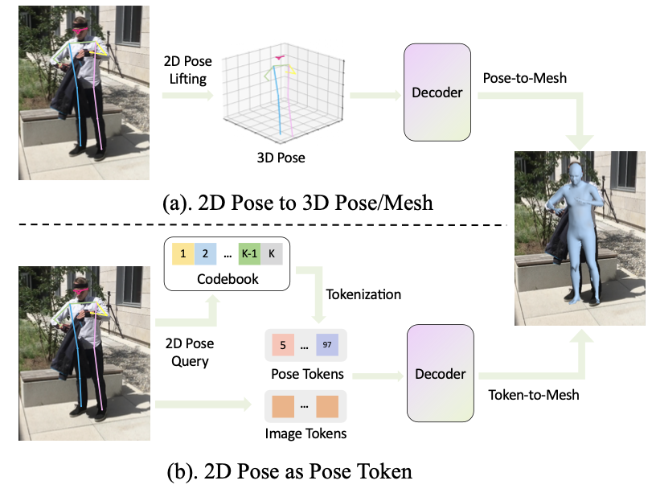
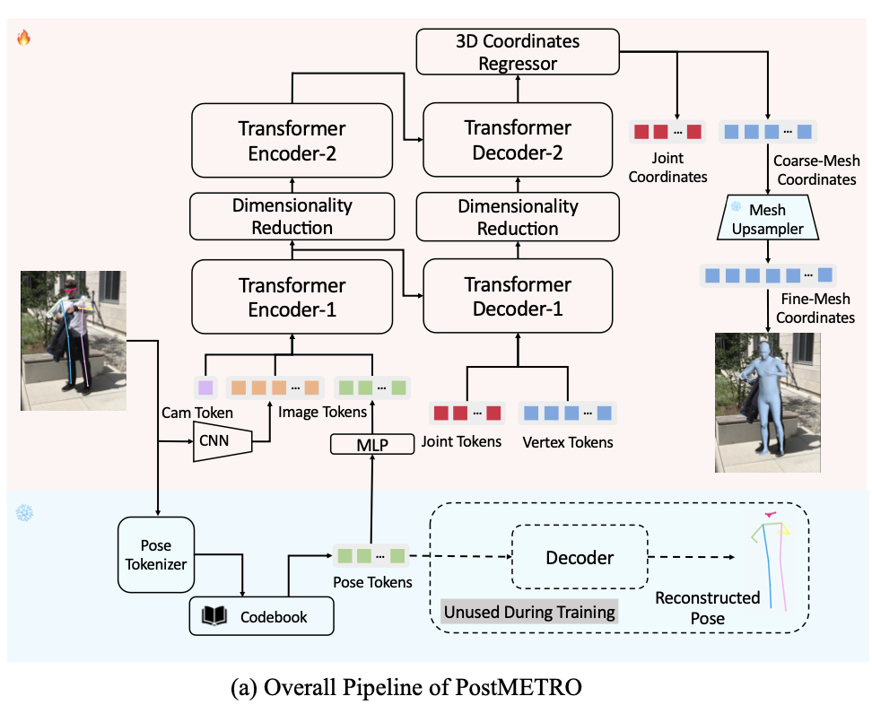
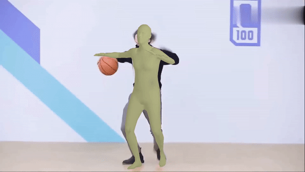
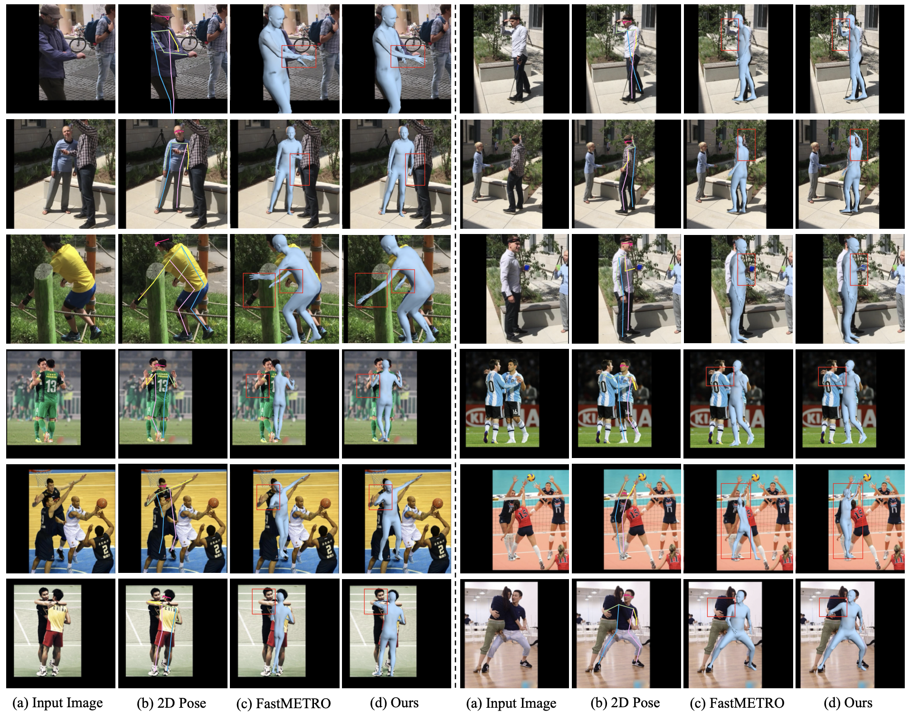
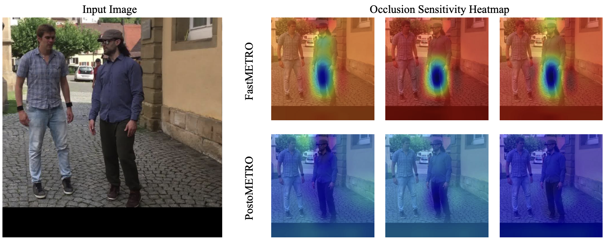
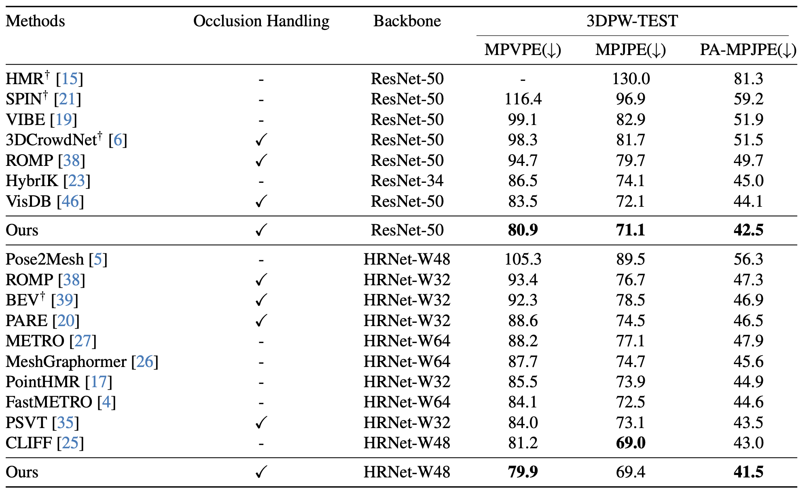
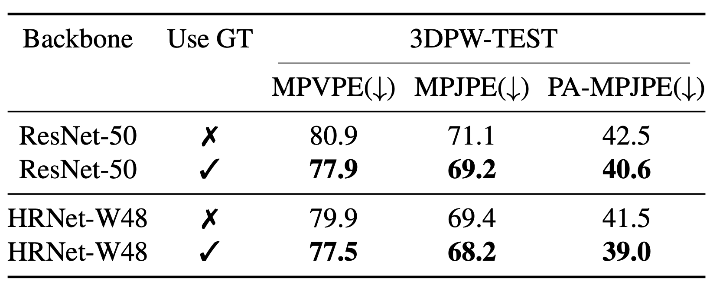
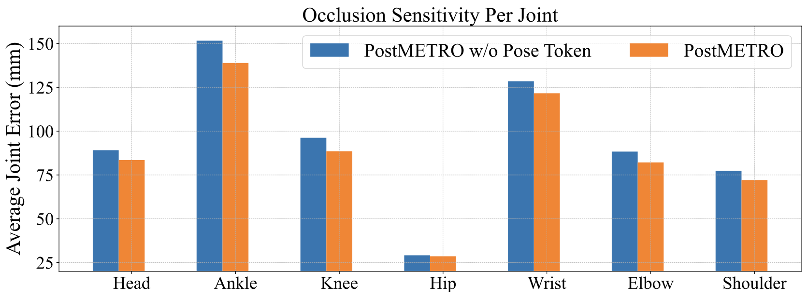

# PostoMETRO-Paper

## Overview

With the recent advancements in single-image-based human mesh recovery, there is a growing interest in enhancing its performance in certain extreme scenarios, such as occlusion, while maintaining overall model accuracy. Although obtaining accurately annotated 3D human poses under occlusion is challenging, there is still a wealth of rich and precise 2D pose annotations that can be leveraged. However, existing works mostly focus on directly leveraging 2D pose coordinates to estimate 3D pose and mesh. In this paper, we present $\textbf{PostoMETRO}$ ($\textbf{Pos}$e $\textbf{to}$ken enhanced $\textbf{ME}$sh $\textbf{TR}$ansf$\textbf{O}$rmer), which integrates occlusion-resilient 2D pose representation into transformers in a token-wise manner. Utilizing a specialized pose tokenizer, we efficiently condense 2D pose data to a compact sequence of pose tokens and feed them to the transformer together with the image tokens. This process not only ensures a rich depiction of texture from the image but also fosters a robust integration of pose and image information. Subsequently, these combined tokens are queried by vertex and joint tokens to decode 3D coordinates of mesh vertices and human joints. Facilitated by the robust pose token representation and the effective combination, we are able to produce more precise 3D coordinates, even under extreme scenarios like occlusion. Experiments on both standard and occlusion-specific benchmarks demonstrate the effectiveness of $\textbf{PostoMETRO}$, and a more than 6% performance improvement compared to our baseline model is obtained. Qualitative results further illustrate the clarity of how 2D pose can help 3D reconstruction. Code will be made available.

  

  

## Visualization 

<!--   -->
We offer some GIF teasers to demonstrate the generalizability of PostoMETRO :point_down:

  
  

  
  

We also compare our method with FastMETRO to show its improvement :eyes:

  

  

For more results, check our paper!

## Result

We also offer quantitive result for better comparison :point_down:

  

  

  

