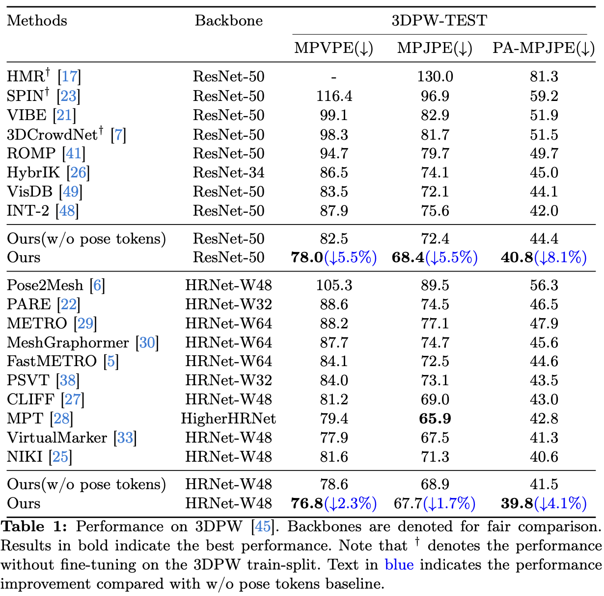
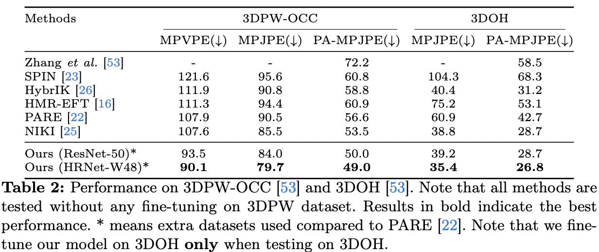

# [WACV 2025] PostoMETRO: Pose Token Enhanced Mesh Transformer for Robust 3D Human Mesh Recovery

- This is a repo for our WACV2025 paper :point_right: **PostoMETRO: Pose Token Enhanced Mesh Transformer for Robust 3D Human Mesh Recovery**
- Our official project page can be found [here](https://postometro.github.io/)

## Preliminary
- Download SMPL neutral parametric model ``basicModel_neutral_lbs_10_207_0_v1.0.0.pkl`` on [SMPLify](https://smplify.is.tue.mpg.de/) and put it under ``src/modeling/data``.

## TODO Lists :memo:

- [x] Release model code.
- [ ] Release Training scripts.
- [ ] Release checkpoints.

## Visualization :eyes:

<!--   -->
We offer some GIF teasers to demonstrate the generalizability of PostoMETRO

  

    

      

        
        
      

      

        
        
      

    

  

We also offer visualization results on 3DPW and OCHuman datasets, and occlusion sensitivity analysis results compared with other baselines

  

  

For more results, check our paper!

## Result :rocket:

We also some offer quantitive results for better comparison

  
  

For more results, check our paper!

## Acknowledgement

Our repository is adapted from the following repositories. Kudos to these great work!
- [HRNet](https://github.com/HRNet/HRNet-Human-Pose-Estimation)
- [SimBA](https://github.com/Microsoft/human-pose-estimation.pytorch)
- [PCT](https://github.com/Gengzigang/PCT)
- [METRO](https://github.com/microsoft/MeshTransformer)
- [FastMETRO](https://github.com/postech-ami/FastMETRO)
- [Pose2Mesh](https://github.com/hongsukchoi/Pose2Mesh_RELEASE)
- [3DCrowdNet](https://github.com/hongsukchoi/3DCrowdNet_RELEASE)
